# Requirements

1. Створіть публічний репозиторій goit-rdb-hw-04 - ✅ 
2. Створіть базу даних для керування бібліотекою книг згідно зі структурою, наведеною нижче. Використовуйте DDL-команди для створення необхідних таблиць та їх зв'язків.

# 1.a Cтворити схему — “LibraryManagement”;
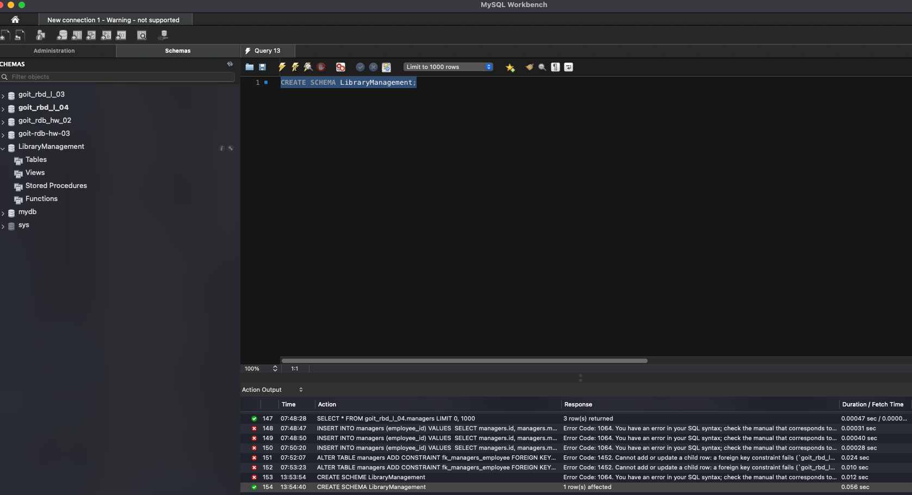

# 1.b Cтворити таблицю — “authors”;
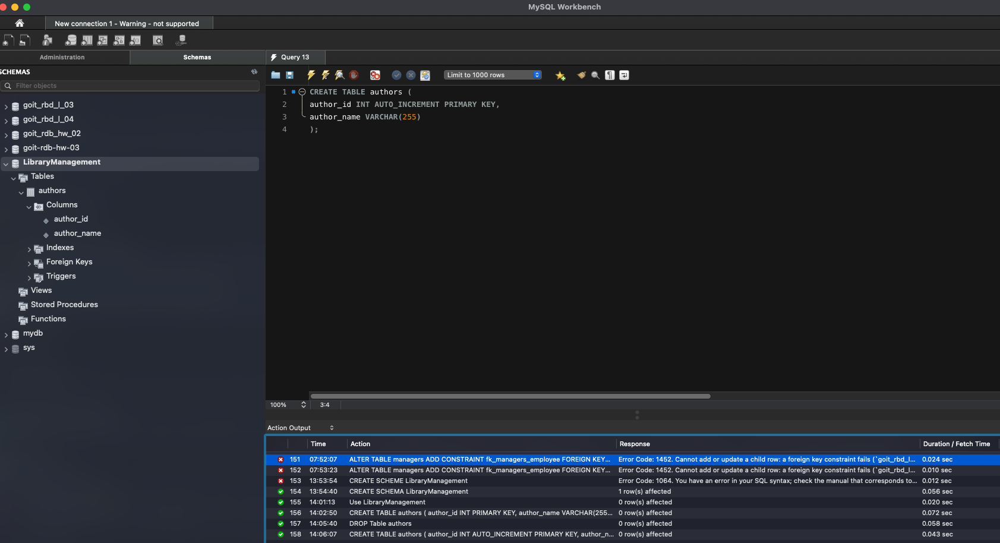

# 1.c Cтворити таблицю — “genres”;
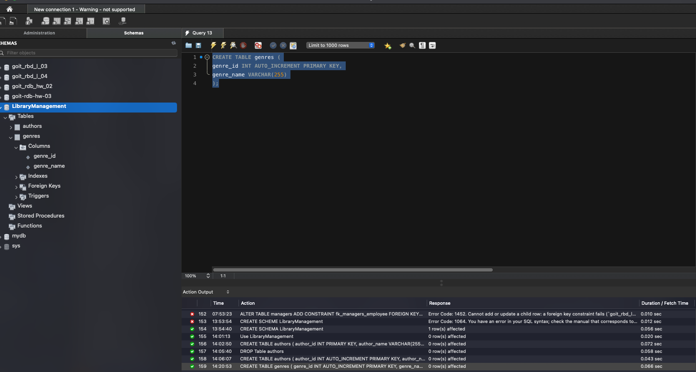

# 1.d Cтворити таблицю — “books”;
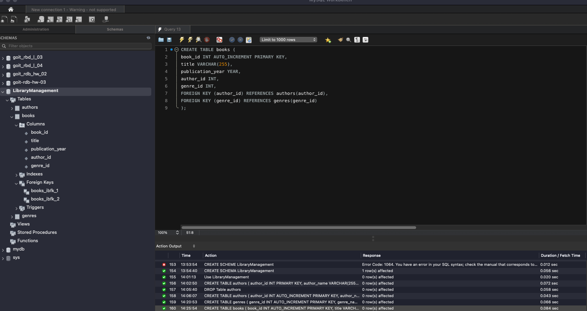

# 1.e Cтворити таблицю — “users”;
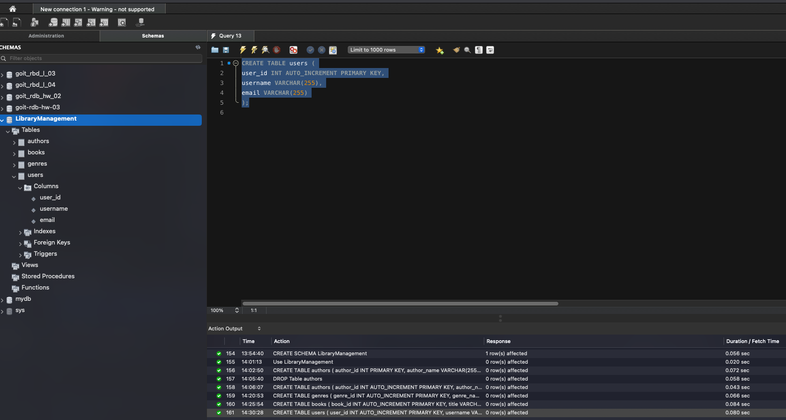

# 1.f Cтворити таблицю — “borrowed_books”;
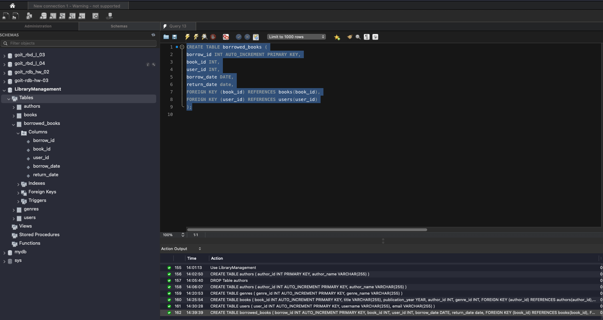

# 2 Заповніть таблиці простими видуманими тестовими даними;
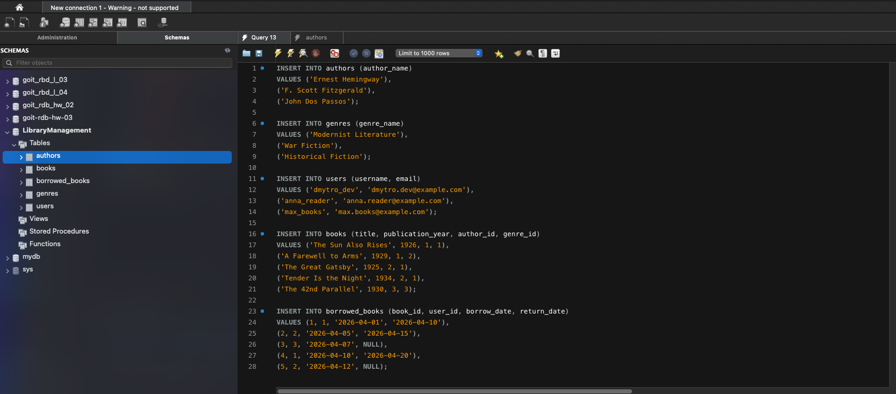

# 3 Перейдіть до бази даних, з якою працювали у темі 3. Напишіть запит за допомогою операторів FROM та INNER JOIN;
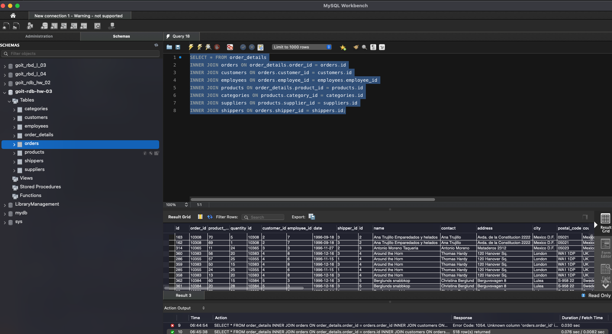

# 4.1 Визначте, скільки рядків ви отримали (за допомогою оператора COUNT).;
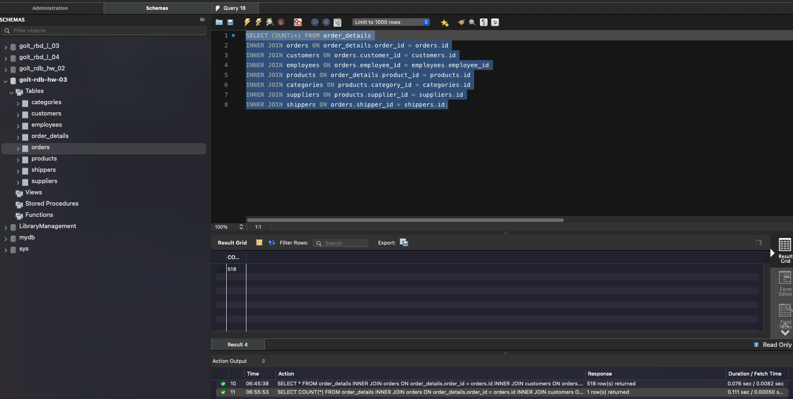

# 4.2 Змініть декілька операторів INNER на LEFT чи RIGHT;
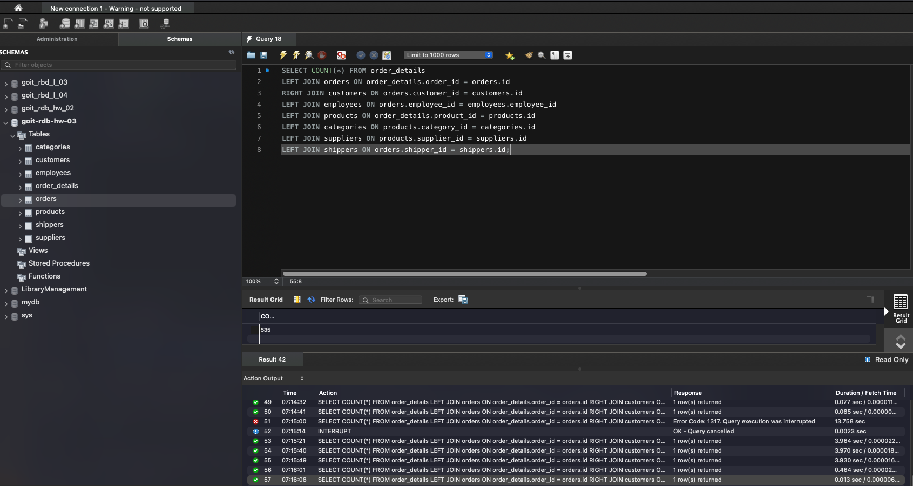

# 4.3 На основі запита з пункта 3 виконайте наступне: оберіть тільки ті рядки, де employee_id > 3 та ≤ 10.;
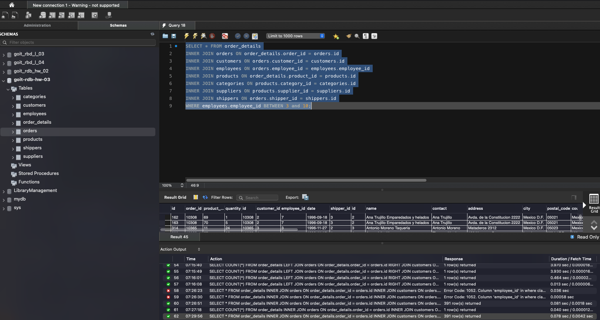

# 4.4 Згрупуйте за іменем категорії, порахуйте кількість рядків у групі, середню кількість товару;
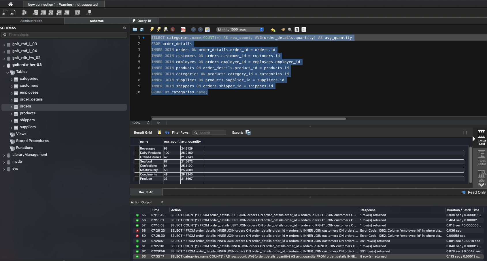

# 4.5 Відфільтруйте рядки, де середня кількість товару більша за 21.;
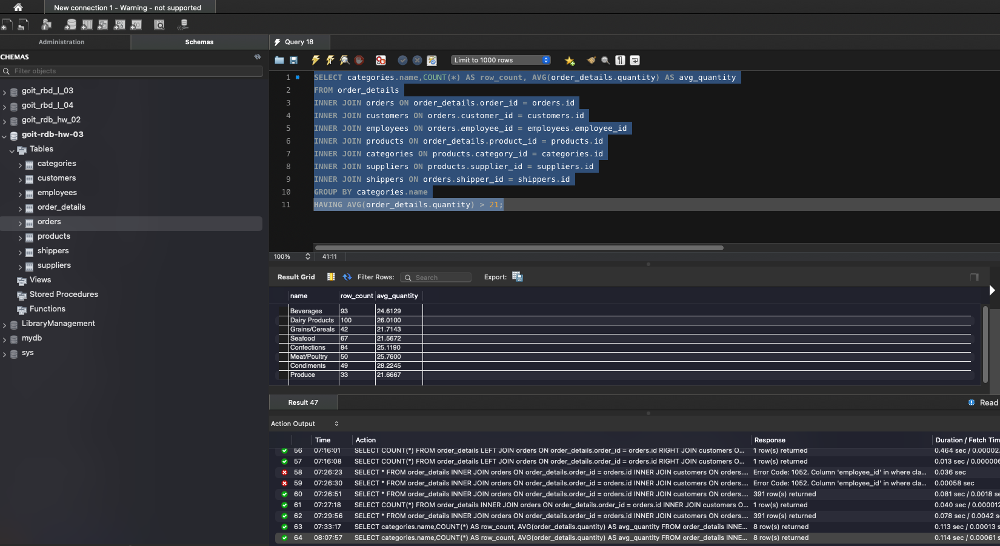

# 4.6 Відсортуйте рядки за спаданням кількості рядків.;
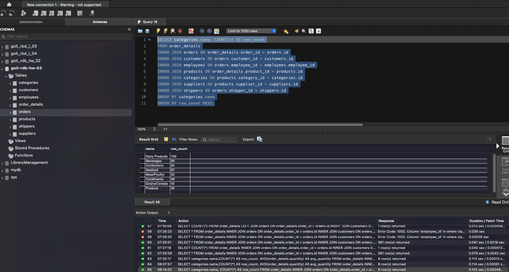

# 4.7 Виведіть на екран (оберіть) чотири рядки з пропущеним першим рядком.;
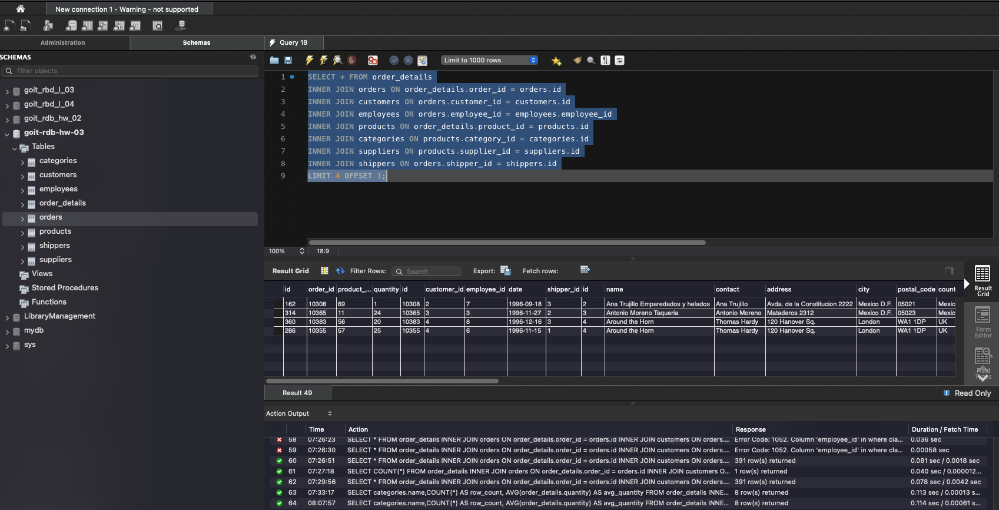